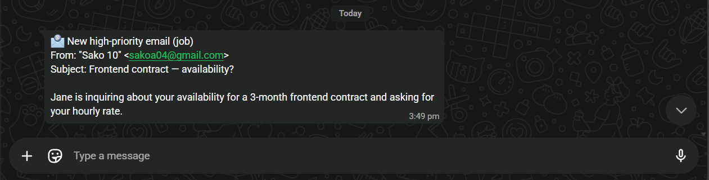
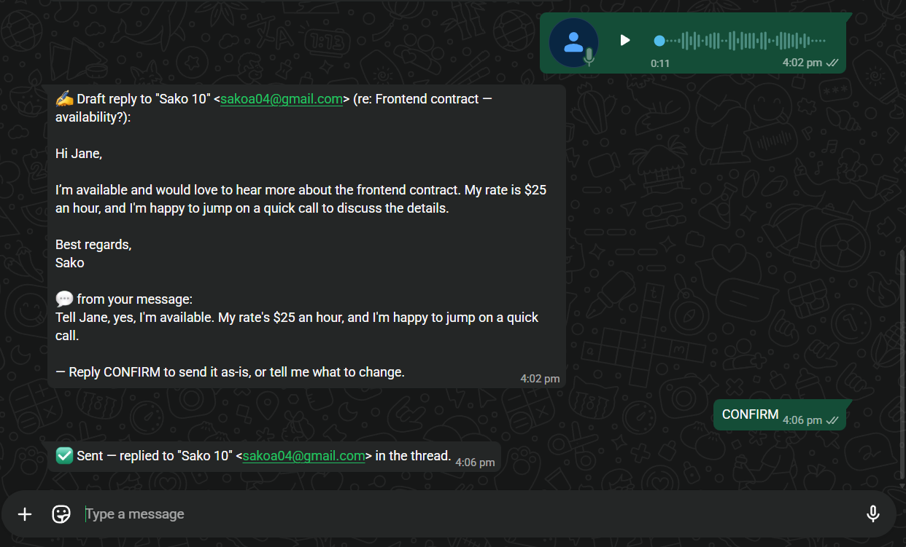
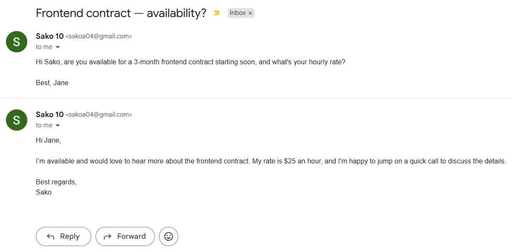
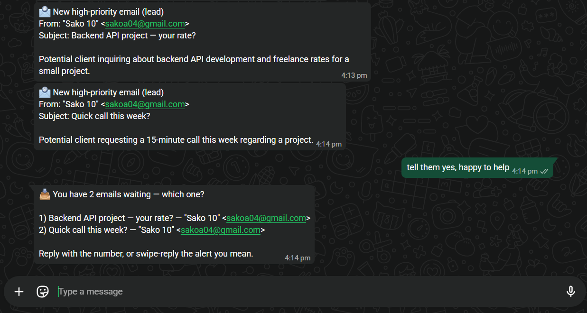
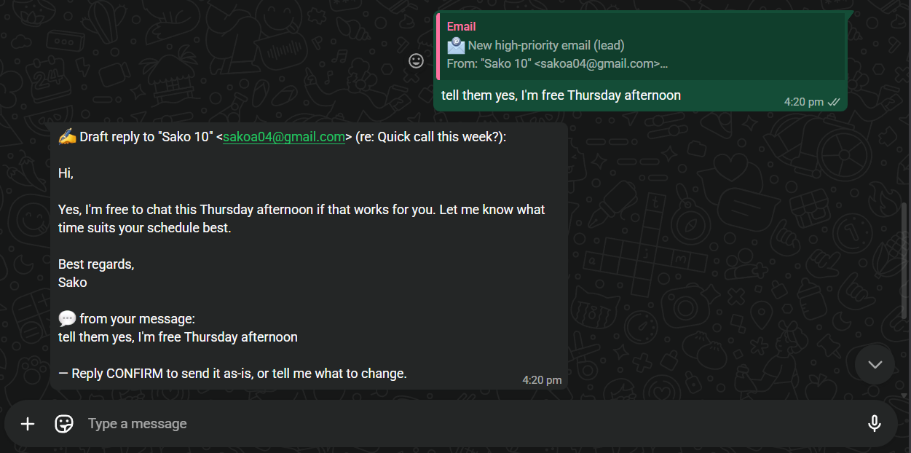
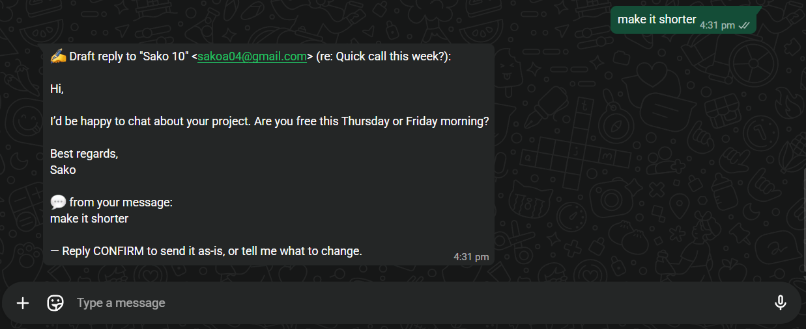
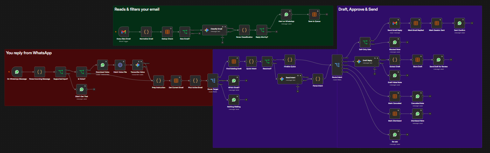
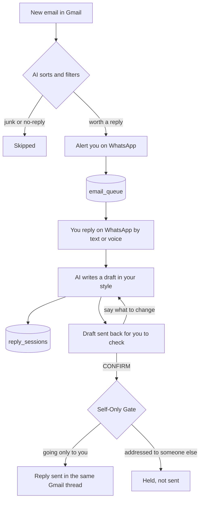

# WhatsApp Email Assistant

Run your Gmail from WhatsApp. It sorts every incoming email, filters out the noise, and pings you only for mail that actually needs a reply. You answer in plain language, by text or voice note, and it drafts a clean, professional reply. You approve or change it in the chat, and once you approve, it replies in the same email conversation.

Built as a single [n8n](https://n8n.io) workflow.

## Flow

Gmail → filter → WhatsApp alert → your reply (text/voice) → draft → approve or change → reply sent in the same conversation

## Screenshots

**New email → WhatsApp alert**

**Voice note → draft → CONFIRM → sent**

**The reply lands in the Gmail conversation**

**Several waiting? It asks which one**

**Change it in plain language**

The draft it sends back first:

After you say "make it shorter":

**The workflow**

## What it does

- **Sorts and filters** — works out what each new email is (client, recruiter, lead, personal, finance…) and only alerts you for the ones worth a reply. Newsletters, promos, and no-reply blasts are skipped.
- **Alerts on WhatsApp** — sender, subject, priority, and a one-line summary.
- **Reply by text or voice** — voice notes are turned into text, and it reads messy spoken instructions (fillers, self-corrections) to work out what you actually mean.
- **Writes in your style** — short and professional, sent back for you to check.
- **Approve / change / cancel / dismiss** — `CONFIRM` to send, or just say what to change and it rewrites it.
- **Replies in the same conversation** — the reply is sent from Gmail as part of the original email, not a new message.
- **Picks the right email** — several waiting? Swipe-reply the one you mean, reply with its number, or it asks which.
- **Safe by default** — until you deliberately go live, it only ever emails *you*, so it can't message a real person by accident. One change flips it live (see Setup).

## How it works

One workflow, three sections (see the canvas above):

1. **Reads & filters your email** — new email in Gmail → pull out the key details → decide if it's worth a reply (borderline ones lean toward yes) → alert you on WhatsApp.
2. **You reply from WhatsApp** — your text or voice → turn voice into text → work out what you're asking for.
3. **Draft, Approve & Send** — it writes the reply and sends it to you to check. Ask for changes and it rewrites, or cancel or dismiss to drop it. When you reply `CONFIRM`, the safe-mode check first makes sure the reply is only going to you, then it sends from Gmail in the same conversation and marks it done.

The flow end to end:

## Tech Stack

- **n8n** — runs the whole flow (single workflow, 48 nodes)
- **Google Gemini** — sorting emails, writing drafts, voice-to-text, understanding your replies
- **WhatsApp Business Cloud API** — where you get alerts and reply
- **Gmail API** — reads incoming mail, sends replies in the same conversation

## Setup

**Requirements** — a running n8n (self-hosted or Cloud) recent enough to have Data Tables and the Google Gemini node, plus accounts for Google Gemini, WhatsApp Business Cloud API, and Gmail.

In n8n, use **Workflows → Import from File** to import both files in `workflows/`, then:

1. **Create the tables** — open `setup_tables.json` and click **Execute workflow** once. It creates `email_queue` and `reply_sessions` (safe to re-run), and the assistant finds them by name.
2. **Add your credentials** — imported nodes read "credential not found" until you create and select your own: **Google Gemini** (AI Studio key), **WhatsApp Cloud API** (Meta access token), **WhatsApp Trigger** (same Meta app), **Gmail OAuth** (Google Cloud client with the Gmail API on).
3. **Your WhatsApp numbers** — set `recipientPhoneNumber` (your number) and `phoneNumberId` (from Meta) on the 11 WhatsApp nodes that send messages, keeping the `={{ '...' }}` format. The one Download Voice node needs only the credential from step 2, not these. Put the same number in the **Allowed Sender?** check too, so the assistant only answers you and ignores messages from anyone else.
4. **Your name** — replace `YOUR_NAME` in four nodes: Classify Email, Draft Reply, Read Intent, and Extract Draft. In Extract Draft it's part of the sign-off rule, so use the same name you put in the Draft prompt.
5. **Safe by default** — put your address in the **Self-Only Gate**. It keeps every reply going only to you, so a first run can't email a real person by accident.
6. **Public URL** — WhatsApp must reach n8n over HTTPS. Set `WEBHOOK_URL`, expose n8n with a tunnel (cloudflared or ngrok) or use n8n Cloud, then set that callback URL and your verify token in the Meta app's webhook settings.
7. **Activate** — switch the workflow to **Active**. Nothing runs until it is.

**Going live** — when you're ready to reply to the real senders, open the **Self-Only Gate** and switch its rule from `recipient equals your email` to `recipient is not empty` (or remove the gate). Switch it back any time to return to safe mode.

**Error alerts (optional)** — to get a WhatsApp ping if the workflow ever errors, point the workflow's **Settings → Error workflow** at an error-handler workflow of your own.

Personal values are placeholders and the export carries credential references only, no keys. The Gemini nodes name specific models (`gemini-3.1-flash-lite`, `gemini-3.5-flash`). Pick an available one if your account differs.

## Troubleshooting

Most first-run problems are quiet, so here is where to look first.

- **Nothing happens on a new email** — check the workflow is switched to **Active**. Also remember WhatsApp only lets a business message you freely inside a 24-hour window (see Known limitations).
- **It ignores your WhatsApp messages** — check your number in the **Allowed Sender?** node. Use international format with no plus sign and no spaces, like `15551234567`.
- **A node says "credential not found"** — that is expected until you connect your own credentials, as in Setup step 2.
- **A model error, or no draft comes back** — your account may not have the named Gemini models. Open the AI nodes and pick one that is available to you.

## Notes

- **Picking which email** — swipe-reply the draft or the alert to point at that exact one. When only one email is waiting, just type your reply and it uses that one. When several are waiting, send its number or swipe the one you mean, and if it still can't tell it asks which one.
- **Spam-filtered mail is invisible** — the Gmail trigger watches the inbox only.
- **Edits keep your facts** — "make it shorter" and other changes revise the existing draft and preserve the details (dates, prices, names), and you review before anything sends.
- **Single workflow** — kept as one for clarity. Heavy use would split the reading and replying into two.

## Known limitations

Honest about what this does not fully handle yet, and what I would do next.

- **WhatsApp's 24-hour window** — alerts are sent by the business, and WhatsApp only delivers those freely within 24 hours of your last message to it. For reliable alerts at any time, going live needs an approved WhatsApp message template.
- **Built for one user** — it is designed around a single person and number. Heavy use, like many emails arriving at once or several drafts in flight, would need more work to handle cleanly.
- **Config lives on each node** — your number, name, and address are set per node today. Centralizing them into one place is a planned improvement.
- **Drafts read the preview, not the full thread** — the reply is written from the email's short preview, not the full message body or the earlier back-and-forth, so a long or deep thread may miss some context.
